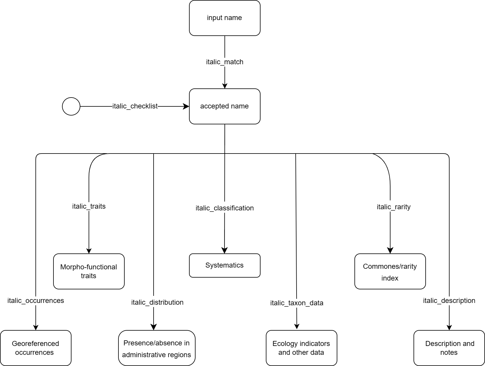
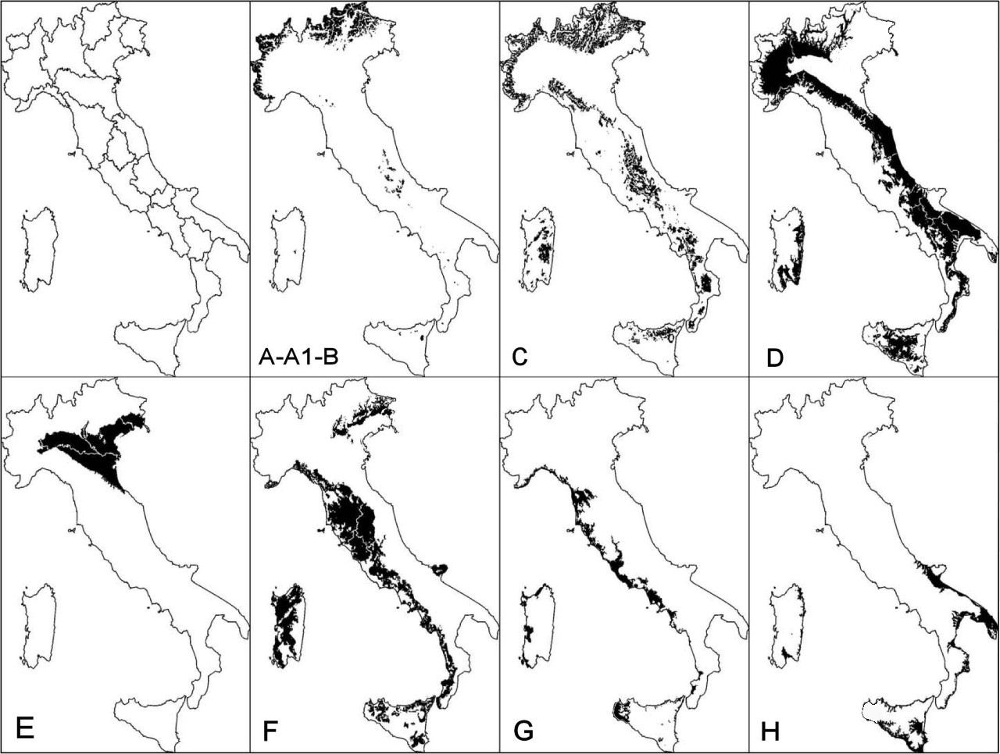
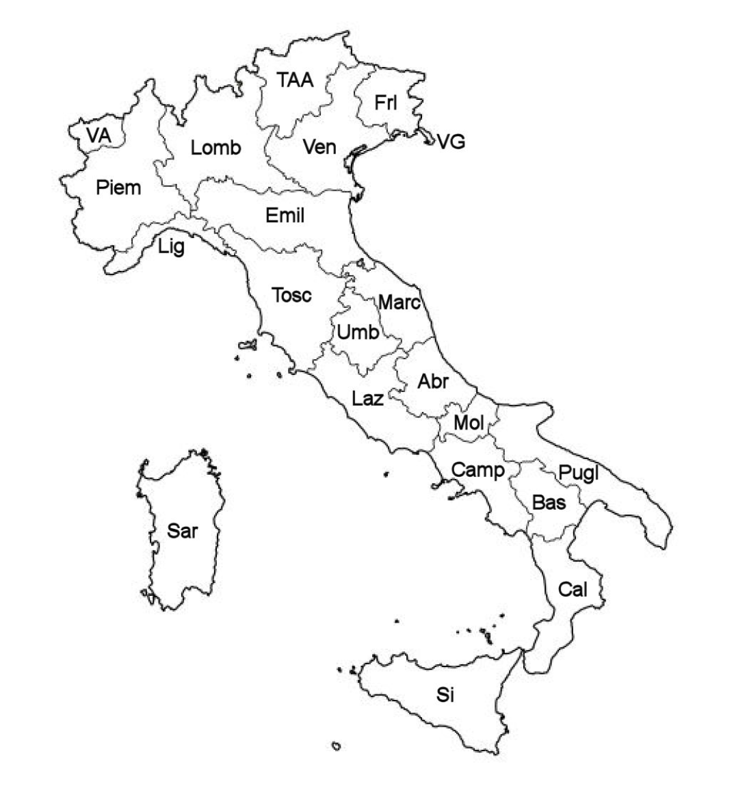

# ritalic

Data and tools of italic are available through ritalic package
* The package can be installed from github using the library devtools
* Soon the library will be avalilable in cran too!
```{r, message=FALSE}
# install and load devtools
# install.packages('devtools') # if not already installed
library(devtools)
# install and load ritalic
devtools::install_github("Mattciao96/ritalic")
library(ritalic)
```


Load some other utility libraries
```{r, message=FALSE}
# dplyer for easier data wrangling
library(dplyr)
# leaflet for interactive maps
library(leaflet)
```

# Exploring the library

structure of the library:



## italic_match
* italic_match is the core function of ritalic:
* takes a list of scientific names as input, aligns them to checklist of ITALIC and retrieves the corresponding accepted names
* accepted names can later be passed to the other functions of the package

```{r, results='hide'}
match <- ritalic::italic_match(c('Cetraria islandica', 'Lecanora albela','Parmelia caperata (L.) Ach', 'Ramalina americana Hal' ))

```
```{r}
match
accepted_names <- match$accepted_name
```
now we can store the accepted names into a variable to easily pass them to the next functions
```{r}
accepted_names <- match$accepted_name
```


## italic_description
return the description and the additional notes of a taxon
```{r, results='hide'}
descriptions <- ritalic::italic_description(accepted_names)
```
```{r}
descriptions
```

### italic_taxon_data
returns data related to the taxon:
<details>
<summary>Substrata and morpho-functional traits:</summary>
<br/>
<b>substrata</b>
<ul>
    <li>saxicolous</li>
    <li>on lignum</li>
    <li>epiphytic</li>
    <li>on soil, terricolous mosses, plant debris</li>
    <li>foliicolous</li>
</ul>
<b>photobiont</b>
<ul>
    <li>green algae other than Trentepohlia</li>
    <li>trentepohlia</li>
    <li>cyanobacteria, filamentous form, e.g. Nostoc, Scytonema</li>
    <li>cyanobacteria, coccaceous form, e.g. Gloeocapsa, Xanthocapsa</li>
</ul>
<b>growth_form</b>
<ul>
    <li>fruticose</li>
    <li>fruticose filamentous</li>
    <li>foliose</li>
    <li>foliose broad-lobed, Parmelia type</li>
    <li>foliose narrow-lobed, Physcia type</li>
    <li>foliose umbilicate</li>
    <li>crustose</li>
    <li>crustose endolithic</li>
    <li>crustose placodiomorph</li>
    <li>leprose</li>
    <li>squamulose</li>
    <li>lichenicolous fungus</li>
    <li>non-lichenized, non-lichenicolous fungus</li>
</ul>
<b>phytoclimatic_range</b>
<ul>
    <li>oceanic</li>
    <li>suboceanic</li>
    <li>subcontinental</li>
</ul>
<b>special_requirements_for_water</b>
<ul>
    <li>on otherwise dry surfaces with periodical seepage of water after rain</li>
    <li>periodical submerged, e.g. in creeks or on coastal maritime rocks</li>
    <li>on surface seldom wetted by rain, e.g. underhangs</li>
</ul>
<b>reproductive_strategy</b>
<ul>
    <li>mainly sexual</li>
    <li>mainly asexual, by soredia or soredia-like structures, e.g. blastidia</li>
    <li>mainly asexual, by isidia or isidia-like structures, e.g. schizidia</li>
    <li>mainly asexual, by thallus fragmentation</li>
</ul>
</details>


<details>
<summary>Ecology indicators, poleotolerance and altitudinal distribution:</summary>
<br/>
<b>ph_of_the_substrata</b>
<ul>
    <li>1 - on very acid substrata, such as lignum and conifer bark</li>
    <li>2 - on acid substrata, such as on non-eutrophicated bark of Quercus</li>
    <li>3 - on subacid to subneutral substrata (e.g. on bark of Sambucus)</li>
    <li>4 - on slightly basic substrata, such as dust-covered bark</li>
    <li>5 - on basic substrata, e.g. pure limestone</li>
</ul>

<b>solar_irradiation</b>
<ul>
    <li>1 - in very shaded situations, e.g. deep gorges, closed evergreen forests</li>
    <li>2 - in shaded situations, such as on the northern side of boles in close-canopied deciduous forests</li>
    <li>3 - in sites with plenty of diffuse light but scarce direct solar irradiation, such as in rather open-canopied deciduous woodlands</li>
    <li>4 - in sun-exposed sites, but avoiding extreme solar irradiation</li>
    <li>5 - in sites with very high direct solar irradiation, such as on the southern side of isolated boles</li>
</ul>

<b>aridity</b>
<ul>
    <li>1 - hydro- and hygrophytic, in aquatic or marine situations, or in sites with a very high frequency of fog</li>
    <li>2 - rather hygrophytic, intermediate between 1 and 2</li>
    <li>3 - mesophytic</li>
    <li>4 - xerophytic, but absent from extremely arid stands</li>
    <li>5 - very xerophytic</li>
</ul>

<b>eutrophication</b>
<ul>
    <li>1 - not resistant to eutrophication</li>
    <li>2 - resistant to a very weak eutrophication</li>
    <li>3 - resistant to a weak eutrophication</li>
    <li>4 - occurring in rather eutrophicated situations</li>
    <li>5 - occurring in highly eutrophicated situations</li>
</ul>

<b>altitudinal_distribution</b>
<ul>
    <li>1 - eu-Mediterranean belt (potential vegetation: evergreen Quercus ilex forest)</li>
    <li>2 - submediterranean belt (deciduous Quercus-Carpinus forests)</li>
    <li>3 - montane belt (Fagus forests, marking treeline in the Apennines)</li>
    <li>4 - subalpine and oroboreal belts of the Alps (natural Picea abies, and Larix-Pinus cembra stands)</li>
    <li>5 - above treeline (both Alpine and oromediterranean)</li>
    <li>6 - nival belt of the Alps</li>
</ul>
<b>poleotolerance</b>
This value points to the tendency of a lichen to occur in areas with different degrees of human disturbance. It is expressed on 4 classes, as follows:
<ul>
    <li>3 - species occurring also in heavily disturbed areas, incl. large towns</li>
    <li>2 - species occurring also in moderately disturbed areas (agricultural areas, small settlements etc.).</li>
    <li>1 - species mostly occurring in natural or semi-natural habitats</li>
    <li>0 - species which exclusively occur on old trees in ancient, undisturbed forests.</li>
</ul>

</details>
```{r, results='hide'}
taxon_data <-  ritalic::italic_taxon_data(accepted_names)
```
```{r}
taxon_data
```

## italic_classification
returns the taxonomical classification of a taxon
```{r, results='hide'}
systematics <- ritalic::italic_classification(accepted_names)
```
```{r}
systematics
```

## italic_rarity
returns the commonness-rarity for each ecoregion of Italy 
<details>
<summary>How to read and understand the values:</summary>

  <h2> Ecoregions in italy</h1>
  <ul>
<li>A: Alpine (above treeline in the Alps and in Abruzzo)</li>
<li>A1: Subalpine (near treeline in the Alps, oroboreal belt)</li>
<li>B: Oromediterranean (above treeline outside the Alps except Abruzzo)</li>
<li>C: Montane (beech forests)</li>
<li>D: Dry submediterranean (deciduous oaks, excluding SmedH)</li>
<li>E: Padanian (the plains of the North): this is the only OGU which was not separated on the basis of climatical-biogeographical characters; it is the most heavily anthropised part of Italy, where several species do not occur because of pollution and/or almost total deforestation</li>
<li>F: Humid submediterranean (as SmedD, but restricted to areas with a warm-humid climate, mostly Tyrrhenian)</li>
<li>G: Humid Mediterranean (mostly Tyrrhenian)</li>
<li>H: Dry Mediterranean</li>
<ul>
</details>
```{r, results='hide'}
rarity <- ritalic::italic_rarity(accepted_names)
```
```{r}
rarity
```

## italic_distribution
returns the presence / absence (1 / 0) of a taxon in each of the 20 administrative regions of Italy
<details>
<summary>Administrative regions of Italy:</summary>

administrative regions of Italy
```{r, results='hide'}
distribution <- ritalic::italic_distribution(accepted_names)
```
```{r}
distribution
```


## italic_occurrences
returns all the georeferenced occurrences of a taxon
```{r, results='hide'}
occurrences <- ritalic::italic_occurrences(accepted_names[1])
```
```{r}
occurrences <- occurrences %>% 
  mutate(decimalLatitude = as.numeric(decimalLatitude)) %>% 
  mutate(decimalLongitude = as.numeric(decimalLongitude)) %>% 
  mutate(coordinatesUncertaintyInMeters = as.numeric(coordinatesUncertaintyInMeters))
nrow(occurrences)
head(occurrences)
```
The occurrences can be displayed in a nice map with leaflet:
```{r}
occurrences %>% 
  leaflet() %>% 
  addTiles() %>% 
  setView(lng = 9.0, lat = 42.0, zoom = 5) %>% 
  #addMarkers(~decimalLongitude, ~decimalLatitude, popup = ~scientificName)
  addCircleMarkers(~decimalLongitude, ~decimalLatitude,
    radius = 3,
    color = "red",
    stroke = FALSE, fillOpacity = 1
  )
```

## italic_checklist
```{r}
checklist <- ritalic::italic_checklist()
length(checklist)
head(checklist)
```


## italic_traits
!!! function in development
retuns a the traits assigned
based on the identification keys in ITALIC
```{r, results='hide'}
traits <- ritalic::italic_traits(accepted_names)
```
```{r}
traits
```


